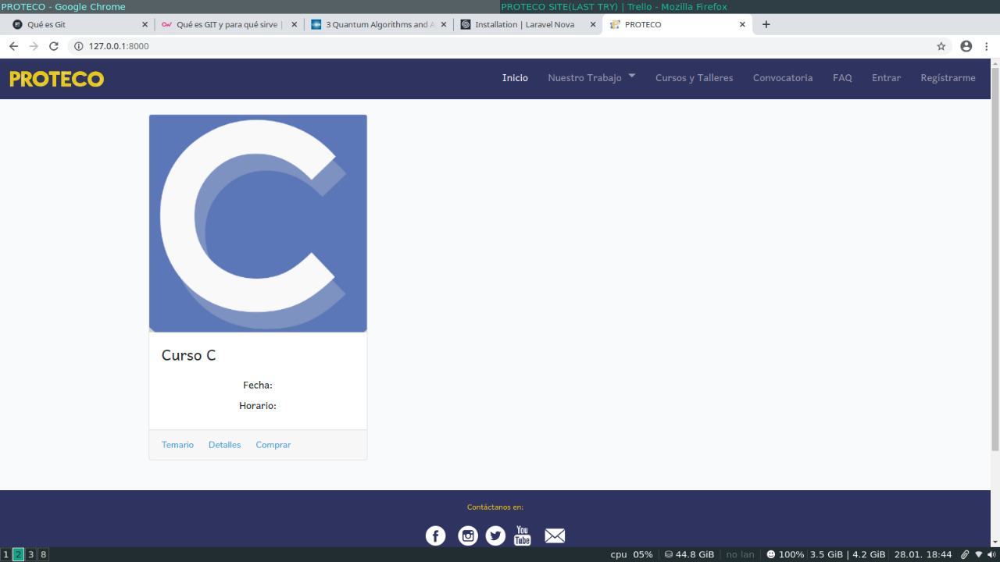

# PROTECO

```shell
Enero 2020
Laravel 6.* | PHP 7.4.0 (cli) | Composer version 1.9.1 | npm 6.12.1
```
Es tiempo de renovar el sitio del programa en tecnología en cómputo, para ello se utilizará un framewrok de php llamado laravel. 

La entrega de está nueva versión del sitio de PROTECO se hará de manera dosificada, es decir, primero entregaremos los más importante, que son los cursos y su inscripción a ellos.

Esta primera versión no incluirá el directorio de becarios ni el control de asesorías por parte del programa. 


## Screenshots



## Installation 

La guía de instalación se puede encontrar en el archivo [INSTALL](INSTALL). 

## Contributing 

La forma de contribuir se explica en [CONTRIBUTING](CONTRIBUTING).

## Licence 

Los términos generales del licenciamiento del proyecto se encuentran en [LICENCE](LICENSE) en caso de 
requerir mayor información, contactar con el autor.